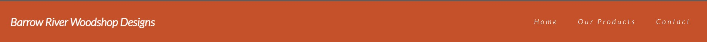
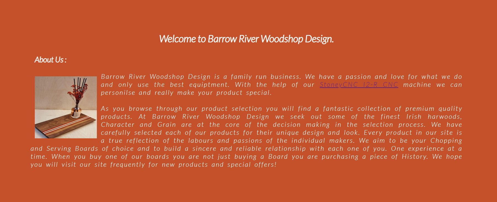
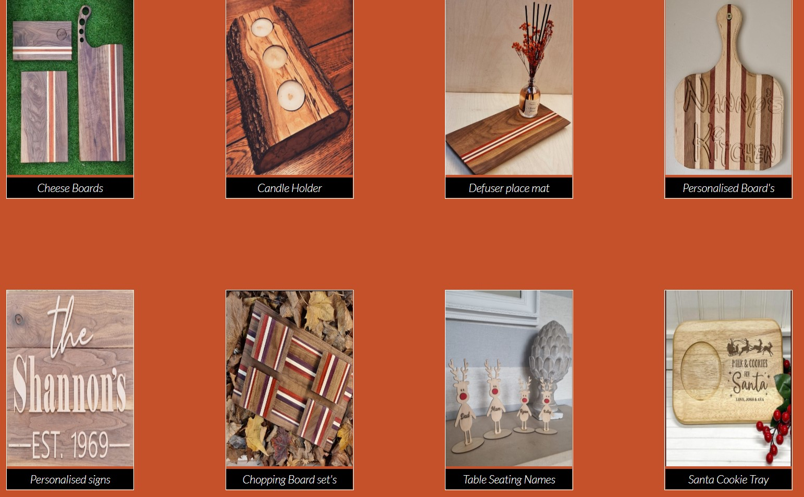
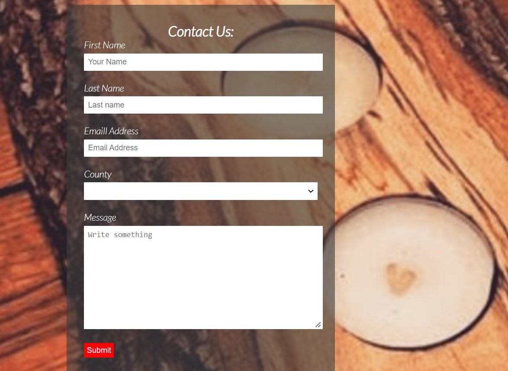

# Borrow River Woodshop Design

## Features

### Existing Features

- __The Nav Bar__

- The fully responsive Nav Bar is featured on all three pages with links to the logo, home, products and contact pages and is identical across all three pages to allow for ease of use.

- __Main Hero Image__

- The landing page has a picture of an original Chopping Board from Barrow River Woodshop Design and soME text to let the user know what the site is about.

- __About us__

- text to go here

- __The Footer__

- The footer section has links to  social media sites for Barrow River Woodshop Design. The links open in a new tab to allow easy navigation for the user
- The footer for this project was inspired from the love running website.

- __Our Products__

- This page is a gallery style layout showcaseing the products availible for sale.
- When the image is clicked on the image will open up in another screen so it custome can get a more detailed look at the product. 

- __The Contact page__

- This page will alow viewers to contact Barrow River Woodshop if they are interested in Purchasing any of there products.
- The Textarea is there so customers can add there messeage in if they want something personalised or just to inquire about Pricing.

### Features Left to Implement

### Validator Testing
- HTML
    - No errors found when put through the [W3S HTML Validator](https://validator.w3.org/nu/?doc=https%3A%2F%2Fjshannon2310.github.io%2FBarrow-River-Woodshop-Design%2F)

- CSS
    - No errors found when put through the [W3S CSS Validator](https://jigsaw.w3.org/css-validator/validator?uri=https%3A%2F%2Fjshannon2310.github.io%2FBarrow-River-Woodshop-Design%2F&profile=css3svg&usermedium=all&warning=1&vextwarning=&lang=en)

### Unfixed Bugs

## Deployment
- The site was developed using GITHUB pages. the steps for deployment as as follows:
    - Open the GitHub repository. 
    - Navigate to the Settings tab
    - In the left handside Nav Bar click on Pages
    - Navigate to the Build and deployment section
    - In the drop down menu in the Branch Section select MAIN and save
    - Refresh the page and the webstie URL was displayed

- Here is the website URL: https://jshannon2310.github.io/Barrow-River-Woodshop-Design/

## Credits

### Content 

- The Icons in the footer were taken from [Font Awesome] (https://fontawesome.com/icons)
- The link in the about me section was fron [Youtube] (https://www.youtube.com/watch?v=DCY8f-ckenY)

### Media
- All Photos use are original supplied from Keith Flemming owener of Barrow River Woodshop Design.
- Video link used is from [Youtube] (https://www.youtube.com/watch?v=DCY8f-ckenY)
