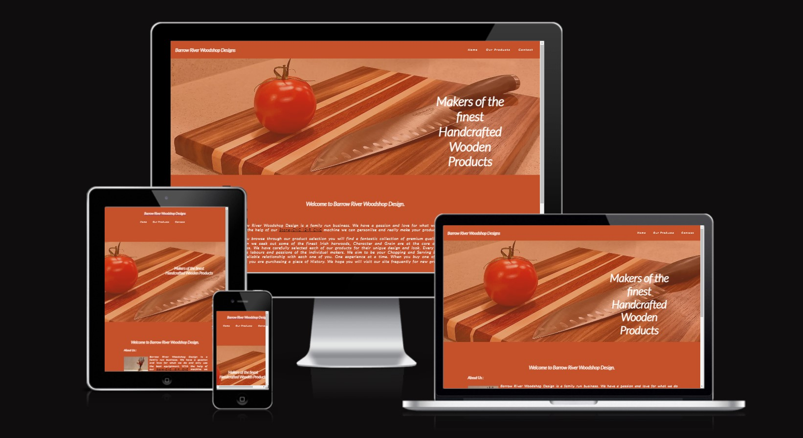
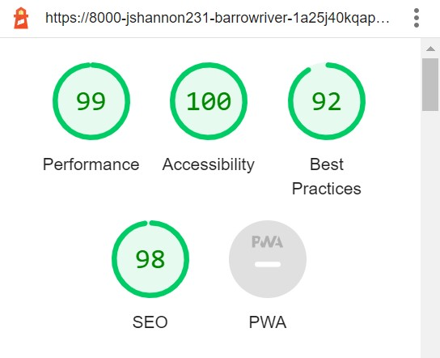

# Borrow River Woodshop Design

- Barrow River Design is a site designed for a fammily member whos hobbie is making some beautiful product from wood. It is he dearm to one day make this Hobbie his living and I hope this site might take him a step closer. The idea of this site is to let the browser know a little more about the company and there products and hopefully in crease sales.

## Features

### Existing Features

- __The Nav Bar__

- The fully responsive Nav Bar is featured on all three pages with links to the logo, home, products and contact pages and is identical across all three pages to allow for ease of use.

- __Main Hero Image__

- The landing page has a picture of an original Chopping Board from Barrow River Woodshop Design and some text to let the user know what the site is about.

- __About us__

- A small few words to let the site browser know a bit about the site owners

- All Text for the Home page was supplied by Barrow River Woodshop Design owner Keith Flemming

- __The Footer__

- The footer section has links to  social media sites for Barrow River Woodshop Design. The links open in a new tab to allow easy navigation for the user
- The footer for this project was inspired from the love running website.

- __Our Products__

- This page is a gallery style layout showcaseing the products availible for sale.
- All images are of Origional Barror River Woodshop Design Products.
- When the image is clicked on the image will open up in another screen so it custome can get a more detailed look at the product. 
- Thank You message added to the bottom of the page with a link to the contact page to make it easy to enquire about ordering.

- __The Contact page__

- This page will alow viewers to contact Barrow River Woodshop if they are interested in Purchasing any of there products.
- The Textarea is there so customers can add there messeage in if they want something personalised or just to inquire about Pricing.

### Features Left to Implement

- I would like to add a hamburger menu to the site when the site is used in smaller screens.

## Testing

- I have done lots of testing on all the links in the site. All the linkis on the top Nav bar work correctly and navigate the user to the correct page. The links in the footer also work as intended with the instagram link navigating to the Barrow River Woodshop Design instagram page and the oter links navigating to the login page of said social meadia site. There is 2 other links used in the web site, ons on the home which navigates to a youtube vide for STONEYCNC and one on the bottom of the contact page which is linked to the contact page. Both work as intended. 

- Testing on the responsive of the site dident go to plan. The origional product page I had designed did not work well in smaller screens. Many hour was spent trying to fix this but in the end I decided to redesign the page and I used a gallery style layout I found on [W3SCHOOLS](https://www.w3schools.com/css/css_image_gallery.asp) which I feel looks better.

- Another problem I came across once I had designed the new gallery was that when I resized the screen the footer was coming up the right hand side of the screen. But with the help of Google and [Freecode Camp](https://www.freecodecamp.org/news/how-to-keep-your-footer-where-it-belongs-59c6aa05c59c/) I wqas able to fix this issue.

### Validator Testing

- lighthouse score

- HTML
    - No errors found when put through the [W3S HTML Validator](https://validator.w3.org/nu/?doc=https%3A%2F%2Fjshannon2310.github.io%2FBarrow-River-Woodshop-Design%2F)

- CSS
    - No errors found when put through the [W3S CSS Validator](https://jigsaw.w3.org/css-validator/validator?uri=https%3A%2F%2Fjshannon2310.github.io%2FBarrow-River-Woodshop-Design%2F&profile=css3svg&usermedium=all&warning=1&vextwarning=&lang=en)

### Unfixed Bugs

- No Bugs at present

## Deployment
- The site was developed using GITHUB pages. the steps for deployment as as follows:
    - Open the GitHub repository. 
    - Navigate to the Settings tab
    - In the left handside Nav Bar click on Pages
    - Navigate to the Build and deployment section
    - In the drop down menu in the Branch Section select MAIN and save
    - Refresh the page and the webstie URL was displayed

- Here is the website URL: https://jshannon2310.github.io/Barrow-River-Woodshop-Design/

## Credits

### Content 

- The Icons in the footer were taken from [Font Awesome] (https://fontawesome.com/icons)
- The link in the about me section was fron [Youtube] (https://www.youtube.com/watch?v=DCY8f-ckenY)
- Products page W3SCHOOLS - but i tried to put my own stam on it
- Love Running project - used the sign up page as a refference for the contact page

### Media
- All Photos use are original supplied from Keith Flemming owener of Barrow River Woodshop Design.
- Video link used is from [Youtube] (https://www.youtube.com/watch?v=DCY8f-ckenY)
